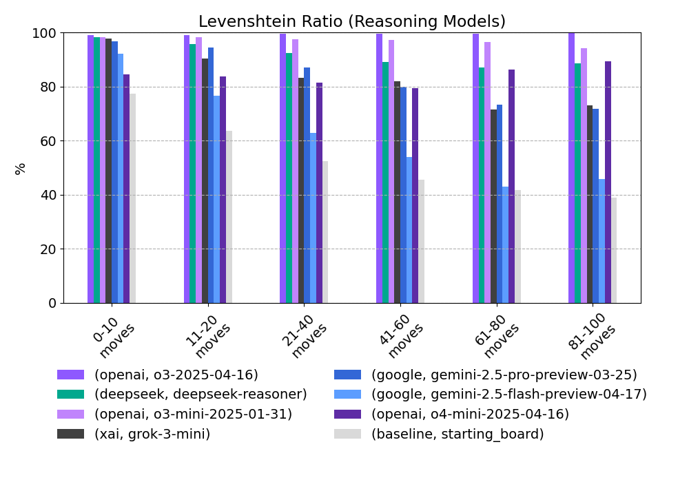
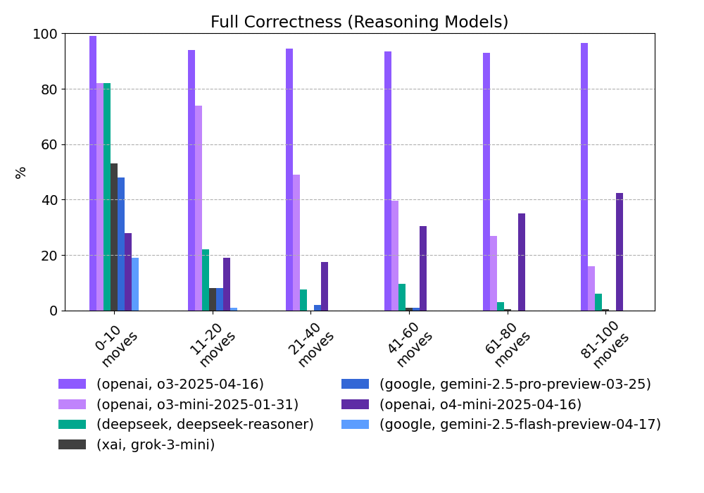
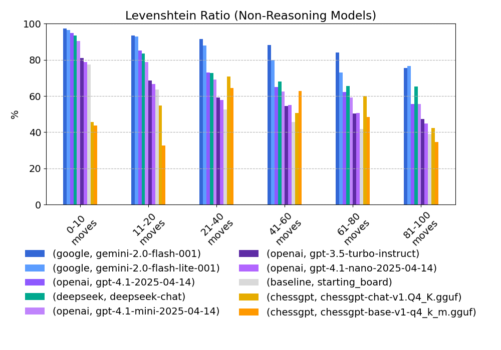

<p align="center">
  
</p>

---


# PGN2FEN Benchmark ♟️

PGN2FEN is a benchmark for evaluating language models' ability to understand and transcribe chess game move sequences.

For more context on this work, refer to the blog post: [PGN2FEN: A Benchmark for Evaluating LLM Chess Reasoning](www.aidancooper.co.uk/pgn2fen-benchmark/)

**Table of contents**

* [Benchmark Leaderboards](#benchmark-leaderboards)
* [Task](#task)
* [Data](#data)
* [Framework](#framework)
* [Installation](#installation)
* [Usage](#usage)
* [Citation](#citation)

## Benchmark Leaderboards

**Last updated:** 2025-08-10

`baseline-starting_board` displays the levenshtein ratio for a dummy model that always predicts the starting board FEN string.

*Coming soon:*
- Anthropic's Claude models

---

### Reasoning Language Models

<p align="center">
  
</p>

<p align="center">
  
</p>

**Levenshtein Ratio (%):**
<div align="center">

| provider   | model                          |   0-10 moves |   11-20 moves |   21-40 moves |   41-60 moves |   61-80 moves |   81-100 moves |
|:-----------|:-------------------------------|-------------:|--------------:|--------------:|--------------:|--------------:|---------------:|
| openai     | o3-2025-04-16                  |         99.1 |          99.1 |          99.7 |          99.7 |          99.7 |           99.8 |
| deepseek   | deepseek-reasoner              |         98.4 |          95.7 |          92.5 |          89.2 |          87   |           88.6 |
| openai     | o3-mini-2025-01-31             |         98.3 |          98.2 |          97.6 |          97.2 |          96.4 |           94.2 |
| xai        | grok-3-mini                    |         97.8 |          90.5 |          83.2 |          82   |          71.6 |           73.1 |
| google     | gemini-2.5-pro-preview-03-25   |         96.8 |          94.5 |          87.2 |          79.9 |          73.3 |           71.9 |
| google     | gemini-2.5-flash-preview-04-17 |         92.1 |          76.6 |          62.8 |          53.9 |          43   |           45.7 |
| openai     | o4-mini-2025-04-16             |         84.6 |          83.8 |          81.6 |          79.5 |          86.4 |           89.4 |
| baseline   | starting_board                 |         77.4 |          63.7 |          52.5 |          45.5 |          41.8 |           39   |

</div>

**Full Correctness (%):**
<div align="center">

| provider   | model                          |   0-10 moves |   11-20 moves |   21-40 moves |   41-60 moves |   61-80 moves |   81-100 moves |
|:-----------|:-------------------------------|-------------:|--------------:|--------------:|--------------:|--------------:|---------------:|
| openai     | o3-2025-04-16                  |           99 |            94 |          94.5 |          93.5 |          93   |           96.5 |
| openai     | o3-mini-2025-01-31             |           82 |            74 |          49   |          39.5 |          27   |           16   |
| deepseek   | deepseek-reasoner              |           82 |            22 |           7.5 |           9.5 |           3   |            6   |
| xai        | grok-3-mini                    |           53 |             8 |           0   |           1   |           0.5 |            0.5 |
| google     | gemini-2.5-pro-preview-03-25   |           48 |             8 |           2   |           1   |           0   |            0   |
| openai     | o4-mini-2025-04-16             |           28 |            19 |          17.5 |          30.5 |          35   |           42.5 |
| google     | gemini-2.5-flash-preview-04-17 |           19 |             1 |           0   |           0   |           0   |            0   |

</div>

---

### Non-Reasoning Language Models

<p align="center">
  
</p>

<p align="center">
  
</p>

**Levenshtein Ratio (%):**
<div align="center">

| provider   | model                        |   0-10 moves |   11-20 moves |   21-40 moves |   41-60 moves |   61-80 moves |   81-100 moves |
|:-----------|:-----------------------------|-------------:|--------------:|--------------:|--------------:|--------------:|---------------:|
| google     | gemini-2.0-flash-001         |         97.3 |          93.5 |          91.6 |          88.3 |          84   |           75.5 |
| google     | gemini-2.0-flash-lite-001    |         96.5 |          92.9 |          88   |          79.9 |          73.1 |           76.6 |
| openai     | gpt-4.1-2025-04-14           |         94.9 |          85.3 |          72.9 |          64.9 |          62.3 |           55.5 |
| deepseek   | deepseek-chat                |         93.5 |          83.4 |          72.8 |          67.9 |          65.5 |           65.3 |
| openai     | gpt-4.1-mini-2025-04-14      |         90.4 |          78.9 |          69.2 |          62.4 |          59.1 |           55.7 |
| openai     | gpt-3.5-turbo-instruct       |         80.9 |          68.7 |          59.2 |          54.4 |          50.2 |           47.4 |
| openai     | gpt-4.1-nano-2025-04-14      |         78.8 |          66.7 |          57.9 |          54.9 |          50.6 |           44.8 |
| baseline   | starting_board               |         77.4 |          63.7 |          52.5 |          45.5 |          41.8 |           39   |
| chessgpt   | chessgpt-chat-v1.Q4_K.gguf   |         45.6 |          54.8 |          70.8 |          50.7 |          60.1 |           42.3 |
| chessgpt   | chessgpt-base-v1-q4_k_m.gguf |         43.7 |          32.6 |          64.3 |          62.7 |          48.5 |           34.5 |

</div>

**Full Correctness (%):**
<div align="center">

| provider   | model                        |   0-10 moves |   11-20 moves |   21-40 moves |   41-60 moves |   61-80 moves |   81-100 moves |
|:-----------|:-----------------------------|-------------:|--------------:|--------------:|--------------:|--------------:|---------------:|
| google     | gemini-2.0-flash-001         |           44 |            10 |           3.5 |           0.5 |           0.5 |              0 |
| google     | gemini-2.0-flash-lite-001    |           36 |             7 |           1.5 |           0   |           0   |              0 |
| deepseek   | deepseek-chat                |           25 |             0 |           0   |           0   |           0   |              0 |
| openai     | gpt-4.1-2025-04-14           |           20 |             1 |           0   |           0   |           0   |              0 |
| openai     | gpt-4.1-mini-2025-04-14      |           17 |             0 |           0   |           0   |           0   |              0 |
| chessgpt   | chessgpt-chat-v1.Q4_K.gguf   |            7 |             2 |           1   |           1   |           0   |              0 |
| chessgpt   | chessgpt-base-v1-q4_k_m.gguf |            5 |             2 |           1.5 |           0.5 |           0   |              0 |
| openai     | gpt-4.1-nano-2025-04-14      |            2 |             0 |           0   |           0   |           0   |              0 |
| openai     | gpt-3.5-turbo-instruct       |            1 |             0 |           0   |           0   |           0   |              0 |

</div>

---

## Task

The task is to translate chess game move sequences notated in [PGN](https://en.wikipedia.org/wiki/Portable_Game_Notation) format into a board state representation using [FEN](https://en.wikipedia.org/wiki/Forsyth%E2%80%93Edwards_Notation). The difficulty of the task is proportional to the number of moves in the game.

## Data

The PGN-formatted games that comprise the benchmark data are prepared from Chess World Cup games sourced via [pgnmentor.com](https://www.pgnmentor.com/files.html#interzonal). These games are truncated to yield 1,000 inputs ranging between 1 and 100 halfmoves (10 examples for each move count) using the [prepare_benchmark_data.py](./scripts/prepare_benchmark_data.py) script.

Games from professional play were deliberately chosen as the foundation for this benchmark, to yield realistic move sequences that align with the models' internalised chess knowledge. Given that state of the art reasoning models such as OpenAI's o3 are close to saturating this benchmark up to 100 halfmoves, future iterations may explore: i) randomly generated, unrealistic game moves sequences; and ii) real-world [chess960 (aka Fischer Random Chess)](https://en.wikipedia.org/wiki/Chess960) games.

## Framework

The codebase includes the following features:
1. API client integrations for generating PGN2FEN results for models from OpenAI, DeepSeek, and Google.
2. Logic for evaluating partially accurate or incomplete FEN strings. Useful for weaker models that struggle to reliably generate fully-formed, valid FEN.
3. More refined FEN comparison logic than direct string matching. Allows for nuanced assessment of ambiguous FEN components, or components with multiple notation conventions.
4. Optionally, extract FEN-like strings from larger blocks of text. Useful for models that do not obey instructions to supply the FEN string directly and nothing else (pervasive for DeepSeek Chat).
5. Tools for analysing and visualising PGN2FEN results.
6. Tools for ingesting and preparing PGN input data.

## Installation

```
git clone git@github.com:AidanCooper/pgn2fen-benchmark.git
cd pgn2fen-benchmark
pip install -e .
```

## Usage

1. Generate FEN outputs for a specific model using the [`run_model_on_benchmark.py`](./scripts/run_model_on_benchmark.py) script.
2. Inspect the results for a specific model using the [`analyse_logs.py`](./scripts/analyse_logs.py) script.
3. Produce benchmark plots and tables using the [`prepare_benchmark_results.py`](./scripts/prepare_benchmark_results.py) script.

Example CLI commands are provided under [scripts/README.md](./scripts/README.md)

## Citation

```
@misc{pgn2fen-benchmark,
  author = {Cooper, Aidan},
  title = {PGN2FEN Benchmark},
  publisher = {GitHub},
  journal = {GitHub repository},
  howpublished = {\url{https://github.com/AidanCooper/pgn2fen-benchmark}},
  year = 2025,
}

```